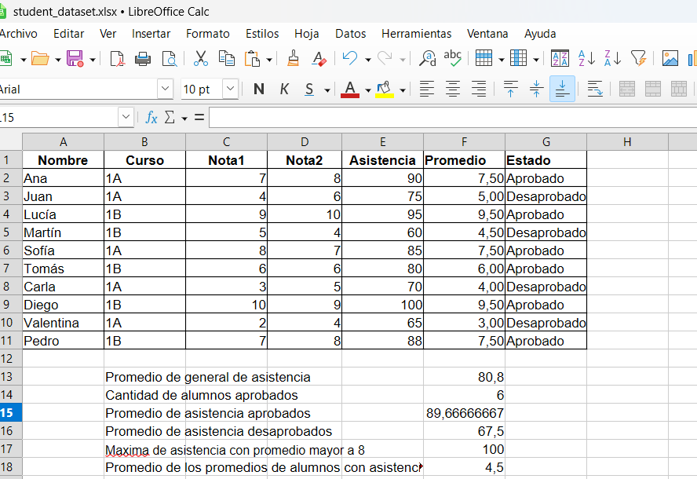

# Student Performance Analysis

## Overview

This project analyzes student academic performance and attendance using spreadsheet formulas.

The goal is to explore the relationship between attendance and academic results.

## Dataset

The dataset contains the following variables:

* Student Name
* Course
* Exam 1 Score
* Exam 2 Score
* Attendance (%)

Additional columns were created:

* **Average Grade**
* **Pass / Fail Status**

Dataset preview:

You can also view the dataset online in Google Sheets:

https://docs.google.com/spreadsheets/d/1lxZselGABXeDtarfuYscGov9KQoVTkI20_ISdmqWZ-c/edit?usp=sharing

The original file is included in this repository:

`student_dataset.xlsx`

## Analysis

Using spreadsheet formulas, the following metrics were calculated:

* Average attendance of all students
* Number of students who passed
* Average attendance of passed students
* Average attendance of failed students
* Maximum attendance among students with average grade above 8
* Average grade of students with attendance below the general average

## Key Results

| Metric                                   | Result |
| ---------------------------------------- | ------ |
| Average attendance                       | 80.8   |
| Students who passed                      | 6      |
| Average attendance (passed)              | 89.67  |
| Average attendance (failed)              | 67.5   |
| Max attendance (avg grade > 8)           | 100    |
| Average grade (attendance below average) | 4.5    |

## Tools

* LibreOffice Calc
* Google Sheets
* Spreadsheet formulas:

  * AVERAGE
  * COUNTIF
  * AVERAGEIF
  * AVERAGEIFS
  * MAXIFS

* Microsoft Excel / Google Sheets
* Excel formulas (AVERAGE, COUNTIF, AVERAGEIFS, MAXIFS)
